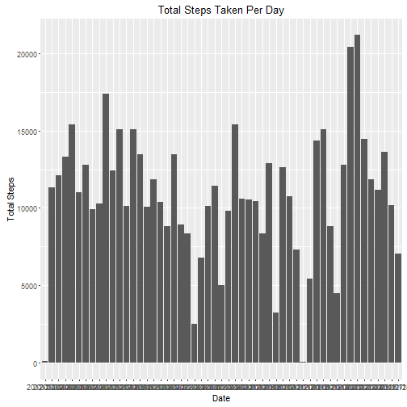
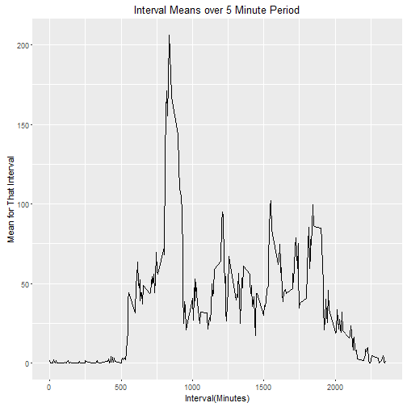
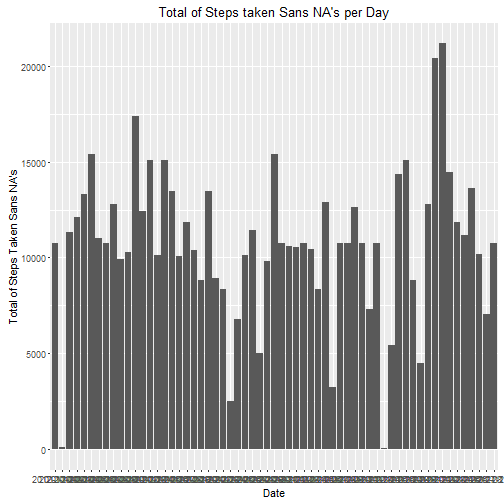
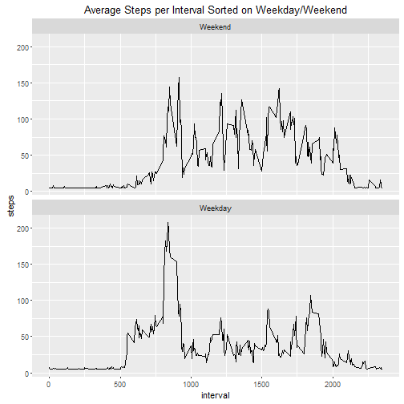

Reprocuble Research Project 1
=============================
#Process

##Section A.1-2: Loading and preprocessing the data and graph the sums

```r
library(ggplot2)
data <- read.csv("activity.csv")
data.sum <- aggregate(steps ~ date, data, sum)
```
##Section B.1: 

```r
sum(data.sum$steps)
```

```
## [1] 570608
```

##Section B.2:

```r
plot1 <- ggplot(data.sum, aes(date, steps)) + 
         geom_bar(stat = "identity") +
         labs(title = "Total Steps Taken Per Day") +
         labs(x = "Date", y = "Total Steps")
print(plot1)
```



##Section B.3: Reporting the mean and median

```r
mean(data.sum$steps)
```

```
## [1] 10766.19
```

```r
median(data.sum$steps)
```

```
## [1] 10765
```
##Section C.1.a:
##Aggregating the data's sum based on five minute intervals

```r
interval.mean <- aggregate(steps ~ interval, data, mean)
```
##Section C.1.b:
##Plotting the interval's means

```r
plot2<- ggplot(interval.mean, aes(interval, steps)) +
        geom_line() +
        labs(title = "Interval Means over 5 Minute Period") +
        labs(x = "Interval(Minutes)", y = "Mean for That Interval")
print(plot2)
```



##Section C.2:
###In order to find the highest value in the plot...

```r
which.max(interval.mean$steps)
```

```
## [1] 104
```

```r
interval.mean[104, ]
```

```
##     interval    steps
## 104      835 206.1698
```

##Section D.1:
##Calculating missing values(NA's) in the data set

```r
sum(!complete.cases(data))
```

```
## [1] 2304
```
##Section D.2-3:
##In order to fix those missing values, we will fill the missing values with the average for all days
###Step 1: Create a data frame with the missing NA's

```r
isNA <- data
```
###Step 2: Fill all the missing values with the mean the Steps column

```r
isNA$steps[is.na(isNA$steps)] <- mean(isNA$steps, na.rm = TRUE)
```

###Step 3: Check to see if it worked (Should be 0)

```r
sum(is.na(isNA$steps))
```

```
## [1] 0
```

##Section D.4a: Get a Total Number of Steps Data Frame Per Day

```r
totalNoNA <- aggregate(steps ~ date, isNA, sum)
```

##Section D.4b: Mean of Filled-in Total Data

```r
mean(totalNoNA$steps)
```

```
## [1] 10766.19
```
##Section D.4c: Median of Filled-in Total Data

```r
median(totalNoNA$steps)
```

```
## [1] 10766.19
```
##Section D.4d: Histogram of the total steps taken each day

```r
plot3 <- ggplot(totalNoNA, aes(date, steps)) +
  geom_bar(stat= "identity") +
  labs(title = "Total of Steps taken Sans NA's per Day") +
  labs(x = "Date", y = "Total of Steps Taken Sans NA's")
print(plot3)  
```




###These values differ from the original mean and median by only a little bit. The new mean and median with NA's replaced are 1 step more.  

##Section E.1: Creating a factor variable of 'weekday' and 'weekend'
###Change date column away from factor to Posixlt and make factor column of weekday/weekend

```r
isNA$date <- as.Date(isNA$date, format = "%Y-%m-%d")
weekday <- c('Monday', 'Tuesday', 'Wednesday', 'Thursday', 'Friday')

isNA$wDay <- factor((weekdays(isNA$date) %in% weekday), levels = c(FALSE, TRUE), labels = c('Weekend', 'Weekday'))
```
###Create a data frame where the average number of steps is taken over wDay

```r
agg <- aggregate(steps ~ interval + wDay, isNA, mean)
head(agg)
```

```
##   interval    wDay    steps
## 1        0 Weekend 4.672825
## 2        5 Weekend 4.672825
## 3       10 Weekend 4.672825
## 4       15 Weekend 4.672825
## 5       20 Weekend 4.672825
## 6       25 Weekend 7.922825
```

```r
str(agg)
```

```
## 'data.frame':	576 obs. of  3 variables:
##  $ interval: int  0 5 10 15 20 25 30 35 40 45 ...
##  $ wDay    : Factor w/ 2 levels "Weekend","Weekday": 1 1 1 1 1 1 1 1 1 1 ...
##  $ steps   : num  4.67 4.67 4.67 4.67 4.67 ...
```
##Section E.2: Create a time series plot based on the weekday/weekend of the 5-minute intervals

```r
y <- ggplot(agg, aes(x = interval, y = steps, group = wDay)) +
     geom_line() +
     labs(title = "Average Steps per Interval Sorted on Weekday/Weekend") +
     facet_wrap( ~ wDay, ncol = 1)
plot(y)
```


